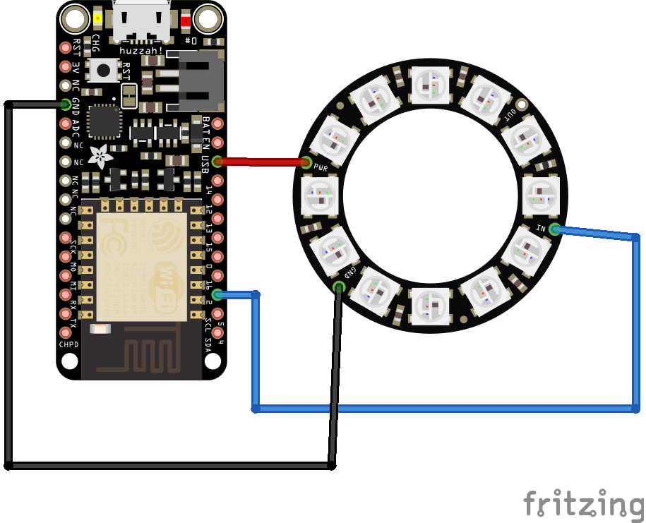

### What is this?
In short, this is a friendly way to notify people in a meeting room that it's time to leave.  This is the firmware for a micro-controller. Read more about at the repo for the web site.   https://github.com/Jonathan75/meeting-room-notification-web#what-is-this


### What Arduino board should I use?
ESP8266 WiFi

I recommend these name brand boards if this is your first time.
[Adafruit Feather HUZZAH with ESP8266](https://www.adafruit.com/product/2821)
[SparkFun ESP8266 Thing](https://www.sparkfun.com/products/13231)

I recommend Amazon and eBay if you need to get them in bulk because you are setting up an entire office.  
Just search your favorite online store for "ESP8266 ESP-12E ModeMCU". You should be able to find these in packs of 5 for $15. Buyer beware, you never know what you are going to get. I don't recommend the version ESP-01 as it's harder to connect to and uses 3.3 volts.  You will also be on your own to figure out the hardware drivers.  

### What LED's should I use?
The LED's Adafruit brand name NeoPixel are also known by their chip name WS2812B or SW2811 are addressable lights.  Addressable because the LED's are chained together and can be controlled individually via the data pin. These can come in strips or rings.  If this is your first time, I recommend the below LED ring.
[Adafruit NeoPixel Ring with 12 LED's](https://www.adafruit.com/product/1643)

When getting them in bulk from eBay search for WS2812b ring. I have gotten them for around $2 a unit.  

### Dictionary
ESP8266 = Arduino IDE compatible WiFi enable micro-controller.  
ESP-12E = Newer version of the ESP8266

### Getting Started

Things you will need.  
- WiFi compatible Arduino board, see [What Arduino board should I use?](what-arduino-board-should-i-use)
- LED's NeoPixel strip or ring, see [What LED's should I use?](what-leds-should-i-use)
- A computer running Windows or Mac

1. Follow these steps for downloading the Arduino IDE software and adding the ESP8266 board at
https://github.com/esp8266/Arduino#installing-with-boards-manager
2. Connect your Arduino compatible board via USB
3. From the menu select Tools > Ports and select the one that sounds like your board. Apologies, the port name is a bit of a guessing game. This is also the time when you know if the hardware drivers for your board are working.  If you unplug the board and nothing is removed from the list, then the driver might not be setup.  
4. Download the code from this repo via the "Download Zip" button or clone it
5. Open the Arduino IDE, that you should have setup in step one
6. From the Arduino IDE open the file `meeting-room-notification-firmware.ino`
1. Include the FastLED library by clicking Sketch > Include Library > Manage Libraries
1. This will show the "Library Manager" dialog
1. From the upper right "Filter your search..." input box enter "FastLED"
1. This should show you the "FastLED" library by "Daniel Garcia"
1. Click install on the "FastLED" button
1. Click Sketch > Verify/Compile
1. The status bar at the bottom should display "Compiling sketch.." then "Done compiling". This confirms that all the libraries are available
1. Now we will configure the variables.  Click the "config.h" file tab at the top
1. Update the variables
```
#define DATA_PIN 5 // should not have to change this
#define NUM_LEDS 12 // should match how many LED's you have connected
#define WIFI_SSID "Your SSID here" // Your wifi SSID.
#define WIFI_PASSWORD "WLAN AP password here" // "Mom, what's the WiFi password?"
#define URL "/rooms/4.json" // The ID of the room that you setup on the website
```
1. Now we just need to upload by clicking Sketch > Upload. This is slow and takes about 30 seconds so be patient.  
1. Wire up the Arduino and LED's as sone below
1. The LED's should pulse white then blue while it connects to the WiFi
1. Click button on the on the website and see if the lights up


